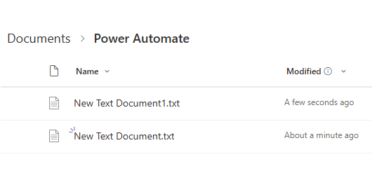

# Incoming Email Monitoring Flow – Power Automate

This Power Automate flow monitors an **Outlook inbox folder** for incoming emails that contain the subject `"Daily Report"` and are sent from a **specific email address**. When such an email is received, the flow extracts any attachments and uploads them to a designated **SharePoint document library**.

---

## Project Description

The flow runs automatically when a new email arrives in a specified Outlook folder. It performs the following actions:

1. **Monitors incoming emails** with the subject containing `"Daily Report"` and a specified sender's email ID.
2. **Loops through each attachment** in the matched email.
3. **Uploads the attachments** to a target **SharePoint site** and folder.

This automation helps streamline the processing of daily report emails without manual download/upload steps.

---

## Connectors Used

- [Office 365 Outlook](https://learn.microsoft.com/en-us/connectors/office365/)
- [SharePoint](https://learn.microsoft.com/en-us/connectors/sharepointonline/)
- Built-in **Control (Apply to Each)** for looping through attachments

---

## Flow Diagram
>Below is a visual of the flow steps in Power Automate

---

## Trigger:
* Runs when an email with the subject containing `"Daily Report"` and a specified sender's email ID

### 📎 Notes

- The flow uses the **“When a new email arrives (V3)”** trigger in Outlook.
- It checks both the **subject line** and **sender's address** for filtering.
- Only emails matching **both** conditions will be processed.
- Each attachment is uploaded with its original filename unless modified in the flow.

---

## Files Included

| File/Folder         | Description                                 |
|---------------------|---------------------------------------------|
| `flow-package/`     | Contains the exported Power Automate flow (`.zip`) |
| `images/`           | Screenshots of the flow for reference       |
| `README.md`         | Project documentation                       |

---

## How to Import and Use the Flow

1. Download the `.zip` file from the `flow-package/` folder.
2. Go to [Power Automate](https://make.powerautomate.com/).
3. Click **"My Flows"** → **"Import"**.
4. Upload the flow `.zip` file.
5. Reconnect the required connectors (Outlook, SharePoint).
6. Configure:
   - The **Outlook folder** to monitor.
   - The **email subject keyword** (e.g., `Daily Report`).
   - The **sender email address** to filter.
   - The **SharePoint site** and **document library/folder** where attachments should be saved.

---

## Requirements

- Microsoft Power Automate account
- Office 365 Outlook mailbox with access to the target folder
- SharePoint site with appropriate write permissions
- Basic knowledge of Power Automate to modify and extend the flow

---

## Sample Input Email

---

## Sample Output

---

## License

This project is licensed under the [MIT License](LICENSE).

---

## Author

Created by **Sunil Sridharmurthy**  
Connect on [LinkedIn](https://www.linkedin.com/in/sunil-sridharmurthy)
